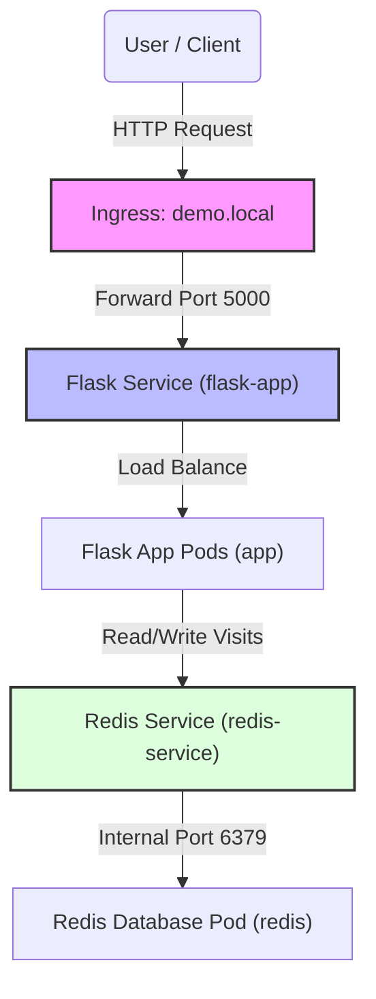

<!--
Copyright (c) 2026 mingju.xu (xumj1125@live.com). All rights reserved.
Licensed under the GNU General Public License v3.0.
-->

# Application Design

This document details the multi-tier application architecture and traffic routing structure.

