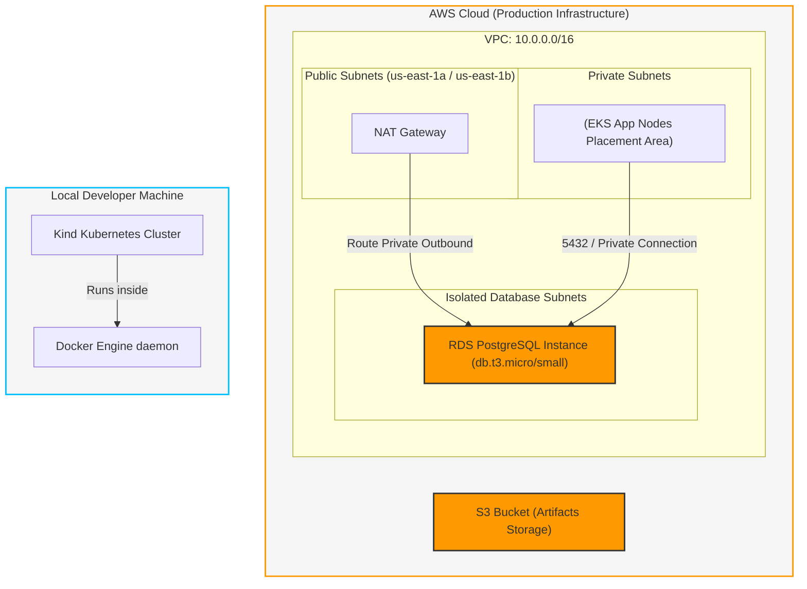

<!--
Copyright (c) 2026 mingju.xu (xumj1125@live.com). All rights reserved.
Licensed under the GNU General Public License v3.0.
-->

# Infrastructure Design

This document describes the cloud (AWS) infrastructure defined by Terraform and the local simulated developer environment (Kind).

