<!--
Copyright (c) 2026 mingju.xu (xumj1125@live.com). All rights reserved.
Licensed under the GNU General Public License v3.0.
-->

# Pipeline Design

This document details the GitHub Actions CI/CD workflows for both application code and infrastructure.

```mermaid
graph TD
  subgraph AppPipeline["Service Pipeline (.github/workflows/service.yml)"]
    CodePushApp["Git Push to app/**"] --> CheckOutApp["actions/checkout"]
    CheckOutApp --> SetupBuildx["Set up Docker Buildx"]
    SetupBuildx --> DockerLogin["Log in to GHCR (via GITHUB_TOKEN)"]
    DockerLogin --> ExtractMeta["Extract Image Tags & Labels"]
    ExtractMeta --> BuildPush["Build & Push Docker Image to GHCR"]
  end

  subgraph InfraPipeline["Infrastructure Pipeline (.github/workflows/infra.yml)"]
    CodePushInfra["Git Push to terraform/**"] --> CheckOutInfra["actions/checkout"]
    CheckOutInfra --> SetupTF["Set up Terraform"]
    SetupTF --> TFFmt["Terraform Format Check (fmt -check)"]
    TFFmt --> TFInit["Terraform Init"]
    TFInit --> TFValidate["Terraform Validate"]
    TFValidate --> TFPlan["Terraform Plan (Dev & Prod)"]
    
    subgraph AutoDeploy["Auto CD (Dev Environment)"]
      TFPlan --> TFApplyDev["Terraform Apply (Dev - Auto)"]
    end
    
    subgraph ApprovalDeploy["Manual CD (Production Environment)"]
      TFApplyDev -->|Triggers after Dev Success| TFApplyProd["Terraform Apply (Prod - Manual Approval)"]
    end
  end

  style AppPipeline fill:#f9f9f9,stroke:#333,stroke-width:1px
  style InfraPipeline fill:#f9f9f9,stroke:#333,stroke-width:1px
  style TFApplyProd fill:#ff9999,stroke:#ff3333,stroke-width:2px
```

